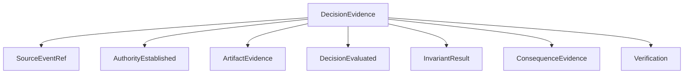

# Audit model

## Current state: Draft
- I've been reading and learning more about AI observability, especially with respect to otel. I generated this document and initial audit decisions earlier on, but I'd like to circle back prior to the MVP to re-assess decision lineage. I'd like to address core questions around agentic observability that neither my current tooling nor readily available observability tools can answer.

## Purpose

SovereignAI's goal with obervability is to go beyond regular telemetry, and put significant focus on gathering the right semantics to make autonomous workflows explainable and auditable after the fact. This means understanding how authority, and specifically warrants, propagate through the system, what inputs and outputs were used and created, and how these elements can relate together. The core principle is using the research I'm reading and synthesizing semantic models across this specific control plane

Audit records are authoritative domain evidence. Application logs, Kubernetes Events, metrics, and traces are valuable operational telemetry, but they are not substitutes for an audit record.

Decision lineage is not a separate datastore or a fourth kind of history. It is a derived view over the audit event stream, joined to the exact artifacts, policies, identities, and telemetry referenced by those events. A playback is a presentation of that lineage. Comparative workflow evaluation is another derived view over the same evidence and telemetry.

## Information boundaries

SovereignAI has four source-of-record boundaries. Keeping them distinct prevents CRDs, audit events, or metrics from becoming unbounded catch-all stores.

| Source | Contains | Does not contain |
| --- | --- | --- |
| Kubernetes state | current desired state and concise observed status/conditions | full transition history or high-frequency telemetry |
| Audit event stream | ordered domain actions, decisions, transitions, attribution, and references | large artifact bodies or every metric sample |
| Telemetry stores | logs, metrics, and traces about runtime behavior | authoritative workflow decisions or approvals |
| Artifact store | versioned inputs, outputs, context bundles, patches, reports, and workspace revisions | lifecycle state or query-optimized event history |

The audit event stream is the spine connecting the other sources. Every event carries stable identifiers and references needed to retrieve related state revisions, artifacts, logs, traces, and metric windows.

Derived products are not additional source boundaries:

- **Decision lineage** answers why a transition or action occurred.
- **Execution playback** presents the ordered workflow history and linked evidence to a human.
- **Workflow evaluation** aggregates outcomes and resource usage across comparable workflows.
- **Operational diagnosis** combines the event timeline with detailed logs, traces, and hardware/application metrics.

## Audit versus observability

| Signal | Primary question | Typical retention/behavior |
| --- | --- | --- |
| Audit event | Who did what, under which authority, to which object? | durable, append-only, access-controlled |
| Log | Why did this component behave this way? | verbose, sampled or rotated |
| Metric | Is the system healthy and how is it performing? | aggregated time series |
| Trace | How did one request flow through components? | sampled request graph |
| Kubernetes Event | What recent cluster condition occurred? | short-lived operational signal |

Correlation identifiers connect these layers, but each retains its own purpose. Kubernetes status answers “what is true now”; the event stream answers “how did it become true”; telemetry helps answer “what was the system doing at that time”; artifacts answer “what information or work product was involved.”

## Decision lineage and playback

Decision lineage is the causal path through the audit event graph. It is assembled using event IDs, causation IDs, workflow/step/attempt IDs, and versioned references. For a failed step, a lineage query should be able to show:

1. which workflow and step definition revision was admitted;
2. which agent image, model, inference runtime, and hardware served the attempt;
3. which context bundle, input artifacts, contracts, and capabilities were supplied (including what changes to the context between inference calls);
4. which tools and platform services were invoked;
5. which state transitions, policy decisions, and validation results occurred;
6. which human actions or approvals affected progression;
7. which failure signal was observed and which recovery policy was selected; and
8. where related artifacts, logs, traces, and metric windows can be inspected.

Playback is a user experience built from that lineage. Initially implemented as a json output, but will be routed through a slightly friendlier projection in html; it does not expose hidden model reasoning or guarantee deterministic re-execution. 

My idea for playback is simple: Can I explain what happened in a way that execution telemetry cannot, and can that explanation actually serve real value, especially under failures? 

The display is still a work in progress, mostly scratch now. A CLI timeline is sufficient for the first implementation; a graphical playback interface may follow.

## Event envelope

Every audit event should include:

- globally unique event ID;
- event type and schema version;
- occurrence and recording timestamps;
- actor identity and actor kind;
- authenticated requester where different from workload actor;
- project, workflow, step, and attempt identifiers;
- workflow-definition and step-definition revisions;
- action and target;
- capability or policy decision authorizing the action;
- policy identifier and version;
- correlation and causation IDs;
- outcome and reason;
- input and output artifact references/digests;
- context-bundle and contract-schema references where applicable;
- agent image digest and wrapper/runtime version where applicable;
- model, quantization, adapter, and inference-runtime versions where applicable;
- inference endpoint and hardware identity where applicable;
- tool or MCP operation reference where applicable;
- related log, trace, and metric correlation references;
- source component; and
- integrity metadata.

Not every event populates every optional reference. Stable identifiers on the relevant lifecycle events allow a lineage query to inherit attempt-level metadata without repeating it on every event.

Illustrative envelope:

```json
{
  "id": "01...",
  "type": "sovereign.step_attempt.started.v1",
  "occurredAt": "2026-09-01T14:00:00Z",
  "actor": {
    "kind": "WorkloadIdentity",
    "id": "spiffe://cluster.local/ns/wf-123/sa/attempt-2"
  },
  "requester": {
    "kind": "User",
    "id": "user@example.internal"
  },
  "subject": {
    "project": "sovereign-ai",
    "workflow": "wf-123",
    "step": "developer",
    "attempt": 2
  },
  "execution": {
    "workflowRevision": "sha256:...",
    "agentImage": "registry.internal/agent@sha256:...",
    "modelRevision": "models/code-small@sha256:...",
    "contextBundle": "artifact://wf-123/context/4",
    "contract": "implementation-plan/v1"
  },
  "action": "execute",
  "outcome": "started",
  "correlationId": "wf-123",
  "causationId": "01..."
}
```

## Minimum event catalog

### Workflow lifecycle

- `WorkflowSubmitted`
- `WorkflowAdmitted` / `WorkflowRejected`
- `WorkflowStarted`
- `WorkflowCompleted` / `WorkflowFailed` / `WorkflowCancelled`

### Step and attempt lifecycle

- `StepReady`
- `StepAttemptStarted`
- `StepAttemptInterrupted`
- `StepAttemptFailed`
- `StepAttemptRetried`
- `StepAttemptSucceeded`

### Capabilities and identity

- `CapabilityRequested`
- `CapabilityGranted` / `CapabilityDenied`
- `WorkloadIdentityIssued`
- `CredentialIssued` / `CredentialRevoked`
- `MCPToolInvoked`

### Artifacts and context

- `ContextRequested`
- `ContextProvided`
- `ArtifactProduced`
- `ArtifactValidated` / `ArtifactRejected`
- `WorkspaceRevisionAccepted`

### Human activity

- `ApprovalRequested`
- `ApprovalGranted` / `ApprovalRejected`
- `HumanSessionRequested`
- `HumanSessionOpened`
- `HumanActionPerformed`
- `HumanSessionClosed`

### Utility and validation

- `GitOperationRequested`
- `GitCommitCreated`
- `MergeRequested` / `MergeCompleted`
- `ValidationStarted`
- `ValidationSucceeded` / `ValidationFailed`

### Failure and recovery

- `FailureObserved`
- `RecoveryPolicySelected`
- `InferenceEndpointUnhealthy`
- `InferenceLeaseAcquired` / `InferenceLeaseReleased`

### Telemetry correlation

- `TelemetryWindowOpened` / `TelemetryWindowClosed`
- `ResourcePressureObserved`
- `PerformanceThresholdExceeded`

These events do not duplicate raw samples. They identify important windows or threshold crossings and reference the metrics/traces used to interpret them.

## Attribution rules

- Model-generated text is attributed to the model-backed attempt, not to the controller.
- Wrapper actions are attributed to the wrapper workload and linked to the supervised attempt.
- Human-session actions include both the authenticated human and session workload identity.
- Utility jobs identify the requesting workflow transition and the platform workload performing the action.
- Controller reconciliation records decisions, but it does not become the author of agent or human artifacts.
- Approvals identify the exact artifact/workflow revision approved.

## Storage and integrity

For the MVP, a simple durable append-only sink is preferable to treating controller logs as evidence. Candidate implementations include an internal service backed by a relational database or an append-only object stream. The interface should allow replacement without changing event producers.

Security requirements include:

- append-only writer permissions;
- restricted reader roles;
- encryption in transit and at rest;
- retention policy separate from workload logs;
- monotonic sequence or ordering within a workflow where practical;
- event schema evolution; and
- integrity validation through hashes, signatures, or immutable storage controls.

The workflow CRD may retain the latest audit cursor or summary, but not the complete event history.

**AUTHOR NOTE:** Select the MVP audit sink. PostgreSQL is operationally straightforward; an object-backed JSONL stream is simpler but harder to query safely under concurrency.

## Sensitive data

Auditability must not become data exfiltration. Events should store references and digests instead of prompt, source code, secret, or model-output bodies by default. Access to sensitive payloads follows artifact classification and authorization policy.

Prompts and context may be separately retained for evaluation only under explicit policy.

## Comparative workflow evaluation

SovereignAI should collect enough consistently labeled evidence to determine where an autonomous workflow is effective and where it fails too often. Evaluation is downstream of execution and must not block ordinary reconciliation unless a workflow explicitly declares an evaluation gate.

Useful comparison dimensions include:

- workflow type, definition revision, and application domain;
- agent, model, inference runtime, and context strategy;
- hardware class and inference-sharing mode;
- success, failure category, retry count, and intervention count;
- contract-validation and first-pass validation rates;
- end-to-end and per-step duration;
- input/output tokens, request latency, throughput, and time to first token;
- GPU utilization, VRAM pressure, CPU, memory, storage, and network use;
- human review time and approval/rejection outcome; and
- compute or operational cost where a meaningful local accounting model exists.

High-frequency hardware metrics belong in the telemetry system. Evaluation records store aggregates and references to the source metric window. Domain-specific quality must be defined by the workflow or validation provider; platform success alone does not prove that an engineering result is correct.

Comparisons must identify the workflow population and domain. A successful microservices-development workflow should not be treated as evidence that a structurally different engineering workflow is equally automatable.

## Audit Events

I will utilize a variety of audit events that can be joined together into a cohesive evidence model for a workflow.




## Demo presentation

The September demonstration should present an execution playback derived from decision lineage. The goal of the playback display will be to build the causal graph of the workflow operation. That graph should be able to answer operational questions, based on the expected MVP failures, to help show how decision lineage (at least as an experiment) could provide a bridge in the agent trust gap.

It should visibly distinguish:

- autonomous agent actions;
- deterministic platform operations;
- human approvals and edits;
- validation results; and
- injected failure and recovery decisions.

The failure segment will focus purely on the lineage, as it best supports the focus of the talk.

## Open audit decisions

- Define a comparison between execution and lineage, showing how execution may retain some of the core information but not in a way that assigns valuable meaning.
