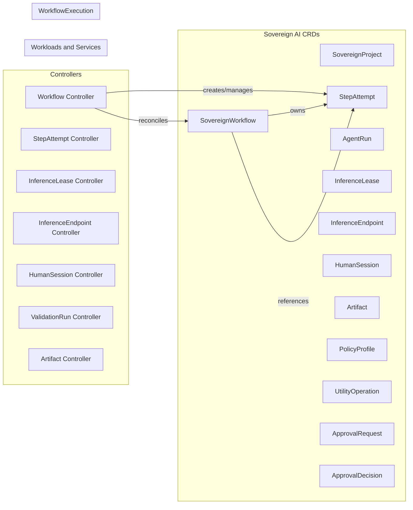

# Controllers Resource Mapping

```mermaid
    flowchart LR

    subgraph Controllers
        direction TB
        workflowController[Workflow Controller]    
        stepAttemptController[StepAttempt Controller]
        inferenceLeaseController[InferenceLease Controller]
        inferenceEndpointController[InferenceEndpoint Controller]
        humanSessionController[HumanSession Controller]
        validationRunController[ValidationRun Controller]
        artifactController[Artifact Controller]
    end

    subgraph Sovereign AI CRDs
        direction TB
        sovereignProject[SovereignProject]
        stepAttempt[StepAttempt]
        sovereignWorkflow[SovereignWorkflow]
        agentRun[AgentRun]
        inferenceLease[InferenceLease]
        inferenceEndpoint[InferenceEndpoint]
        humanSession[HumanSession]
        artifact[Artifact]
        policyProfile[PolicyProfile]
        utilityOperation[UtilityOperation]
        approvalRequest[ApprovalRequest]
        approvalDecision[ApprovalDecision]
    end

    subgraph Workloads and Services
        direction TB
    end

    subgraph WorkflowExecution
        direction TB
        workflowController -->|reconciles| sovereignWorkflow
        workflowController -->|creates/manages| stepAttempt
        sovereignWorkflow -->|owns| stepAttempt
        sovereignWorkflow -->|references| stepAttempt
    end

```

## Changes to primary and owned resources enqueue reconciliation through controller-runtime watches.