# Execution model

## Goals

The execution model makes autonomous work resumable, attributable, and bounded. It distinguishes declared workflow intent from individual execution attempts and separates agentic reasoning from deterministic privileged operations.

The MVP supports predefined, sequential workflows. Parallel branches and dynamically amended plans are post-MVP concerns.

## Workflow definition

A workflow definition should declare:

- project and repository target;
- ordered steps;
- step execution kind;
- typed inputs and outputs;
- required capabilities;
- model and inference policy;
- retry and timeout policy;
- approval and validation gates; and
- workspace and retention requirements.

Illustrative—not final—shape:

```yaml
apiVersion: sovereign-ai.io/v1alpha1
kind: SovereignWorkflow
metadata:
  name: controller-change
spec:
  projectRef: sovereign-ai
  repositoryRef: platform
  steps:
    - name: architect
      kind: Agent
      agent:
        responsibility: Produce an implementation plan
        image: software-agent:dev
        executable: ["/domain-agent", "--role", "architect"]
        inference:
          model: reasoning-small
          modelRevision: stable
          estimatedKVRAMMiB: 2048
          sharingScope: Dedicated
        capabilities:
          - context.read
      inputs:
        - contract: change-request/v1
      outputs:
        - contract: implementation-plan/v1
    - name: create-branch
      kind: Utility
      utility:
        name: git.createBranch
        parameters:
          branch: feature/control-plane-boundary
    - name: developer
      kind: Agent
      agent:
        responsibility: Implement the admitted plan
        image: software-agent:dev
        executable: ["/domain-agent", "--role", "developer"]
      inputs:
        - contract: implementation-plan/v1
      outputs:
        - contract: change-set/v1
    - name: test-writer
      kind: Agent
      agent:
        responsibility: Produce tests for the admitted requirements and developer files
        image: software-agent:dev
        executable: ["/domain-agent", "--role", "test-writer"]
      inputs:
        - contract: implementation-plan/v1
        - contract: change-set/v1
      outputs:
        - contract: test-change-set/v1
    - name: tests
      kind: Utility
      utility:
        name: test.run
    - name: approval
      kind: HumanGate
      approval:
        mode: AnyOf
        requiredGroups: ["maintainers"]
        denyBehavior: Fail
    - name: commit
      kind: Utility
      utility:
        name: git.commit
        parameters:
          message: Implement the admitted change
    - name: preview
      kind: Validation
      validation:
        provider: argocd-kustomize
```

The exact ordering for the MVP remains open; see [MVP scope](../mvp.md).

## State machines

### Workflow phases

```text
Pending -> Provisioning -> Running -> AwaitingApproval -> Validating -> Succeeded
    |            |           |              |                |
    +------------+-----------+--------------+----------------+--> Failed
                             |
                             +--> Intervening --> Running
                             |
                             +--> Cancelling --> Cancelled
```

Not every workflow visits every phase. Phase names must have one unambiguous meaning and be encoded as tested constants.

### Step phases

```text
Pending -> Ready -> Running -> Succeeded
                   |   |
                   |   +--> AwaitingHuman -> Succeeded / Failed
                   |
                   +--> Failed -> Retrying -> Ready
```

A retry creates a new `StepAttempt`. It does not reset or erase the prior attempt.

`StepAttempt` is deliberately not an execution union. The workflow controller snapshots the selected step into one owned domain primitive:

```text
StepAttempt
  -> AgentRun | UtilityOperation | ApprovalRequest | ValidationRun
```

The domain controller owns execution and status. The StepAttempt controller observes the typed execution reference and projects its phase, failure reason, and retryability into workflow lifecycle. This prevents agent delegation fields, utility authority, approval policy, and validation provider state from sharing one mutable specification.

### Attempt phases

```text
Created -> Admitted -> Preparing -> Executing -> Collecting -> Succeeded
                         |             |             |
                         +-------------+-------------+--> Failed
                                       |
                                       +--> Interrupted
```

`Interrupted` identifies deliberate platform or human interruption. It is distinct from an infrastructure failure.

## Exclusive workspace writer authority

Each workflow owns one `coordination.k8s.io/v1` Lease for its mutable workspace. `AgentRun`, `UtilityOperation`, and `HumanSession` controllers must acquire that Lease before creating any workload with a writable workspace mount. A collector runs under the same grant as its producing execution unit and the grant is retained through artifact collection.

The Lease `holderIdentity` contains the execution kind, namespace, resource name, and immutable UID. `leaseTransitions` is the writer epoch: the first grant receives epoch 1, release clears the holder without resetting the counter, and every subsequent grant increments it. The lease name, holder identity, and epoch are copied into runtime contracts, workload annotations, environment, status, and audit references.

The Lease is an authority and coordination primitive, not a filesystem lock. The controllers therefore never reassign an expired term while its previous workload is still active. Before release or finalizer completion, the controller proves that the execution pod/job and its collector are terminal or absent. An execution resource that observes a different holder or epoch interrupts its workload rather than reacquiring silently. A new execution unit is admitted only after the previous writer releases its exact term.

This guarantees exclusivity for workloads created through the SovereignAI control plane. Cluster administrators or other principals able to mount the PVC or modify the Lease remain outside this boundary and must be constrained by Kubernetes RBAC and admission policy.

The resulting authority lifecycle is defined in the
[execution model](../docs/architecture/execution-model.md#exclusive-workspace-writer-authority).

```mermaid
stateDiagram-v2
    direction LR

    state "No authorized writer<br/>holderIdentity = empty<br/>epoch = n" as Available
    state "Writer authorized<br/>holderIdentity = execution unit<br/>epoch = n + 1" as Active
    state "Waiting for quiescence<br/>same holder and epoch retained" as Quiescing
    state "Authority lost<br/>stale execution term" as Lost
    state "Epoch exhausted<br/>acquisition prohibited" as Exhausted

    [*] --> Available: Workflow creates Lease<br/>epoch = 0

    Available --> Available: Request is not authorized<br/>deny request

    Available --> Active: Valid delegation and lifecycle<br/>atomic acquisition succeeds<br/>set holder; increment epoch<br/>audit acquisition

    Available --> Exhausted: Acquisition requested<br/>epoch = maximum value

    Active --> Active: Same execution reconciles<br/>holder and epoch match<br/>recover exact term

    Active --> Active: Competing execution requests authority<br/>block request

    Active --> Quiescing: Execution completes, is interrupted,<br/>or begins deletion

    Quiescing --> Quiescing: Writer or collector remains active<br/>retain authority term

    Quiescing --> Available: Writer and collector are terminal or absent<br/>clear holder; retain epoch<br/>audit release

    Active --> Lost: Observed holder or epoch differs
    Quiescing --> Lost: Observed holder or epoch differs

    Lost --> [*]: Interrupt stale workload<br/>do not reacquire or release changed term

    Exhausted --> [*]: Require explicit remediation<br/>never wrap or reset epoch

    note right of Active
        Only the exact holder and epoch
        receive a writable workspace mount.

        Lease expiry alone never transfers
        workspace authority.
    end note

    note right of Quiescing
        Authority remains held through
        artifact collection.
    end note

    note right of Available
        The Lease is a coordination and authority
        record, not a filesystem lock.

        RBAC and admission policy protect Lease
        mutation and direct writable PVC mounts.
    end note
```


## Agent runtime contract

The Go wrapper supervises an arbitrary agent executable supplied by a custom image. It enforces a platform contract without dictating the agent framework.

The initial file contract is:

- `/workspace/control/input.json`: immutable task and context references;
- `/workspace/control/result.json`: terminal result and artifact declarations;
- `/workspace/control/events.jsonl`: optional structured runtime events;
- `/workspace/artifacts/...`: produced files; and
- a process exit code interpreted alongside `result.json`.

The wrapper is responsible for:

- validating the input contract;
- launching and supervising the configured executable;
- forwarding termination with a bounded grace period;
- recording process metadata and terminal status;
- validating declared outputs and calculating digests;
- refusing undeclared privileged behavior where enforceable; and
- emitting attempt lifecycle events.

The wrapper must not contain agent reasoning or Git credentials.

## Artifact contracts

Artifacts should be formally typed even when a step may produce a variable number of them. A contract contains:

- stable contract name and version;
- media type or schema;
- cardinality;
- producer step and attempt;
- content digest;
- storage reference;
- security classification; and
- validation status.

Examples include `implementation-plan/v1`, `change-set/v1`, `test-change-set/v1`, `test-report/v1`, and `validation-result/v1`.

Variable output is represented as a collection conforming to a declared contract, not as untyped files discovered after execution.

## Deterministic utility steps

Utility steps execute narrow, audited operations without model inference. Git is the first important example.

Agents inspect repository material and mutate isolated attempt overlays through bounded context capabilities. Trusted runtime code materializes those overlays as complete changed-file manifests. Agents do not receive repository credentials. Trusted utility jobs perform operations such as:

- clone or initialize workspace;
- create a workflow branch;
- verify accepted file base digests and stage the declared complete results;
- commit with workflow and artifact provenance;
- push a branch;
- create a merge request; and
- merge only after required policy, approval, CI, and validation.

Every utility step receives a typed request, a least-privilege credential, a restricted network policy, and a terminal output contract.

The workflow declares a named utility request, not a shell command. The workflow controller creates an immutable `UtilityOperation` CRD. Its controller derives one stable idempotency key per workflow step, evaluates policy, resolves the Project repository and test/build templates, and mounts an operation-scoped credential only when the admitted operation requires it. `repository.initialize`, `git.createBranch`, `git.commit`, `git.push`, `git.merge`, `git.mergeRequest`, `test.run`, and `build.image` are the MVP operation vocabulary.

The canonical workflow uses a `git.mergeRequest` to finish the workflow with a pull request,
without merging the target. No useful message is currently included with the merge at this time.

## Human gates and intervention

A human gate asks an authorized person to approve, reject, or request intervention.

Intervention follows this sequence:

1. stop accepting new autonomous actions;
2. terminate or quiesce the active agent attempt at a defined boundary;
3. record the last accepted workspace revision;
4. authorize and create a separately identified `HumanSession` pod;
5. mount the same workspace and expose approved development tooling;
6. record attributable human changes and explicit capability approvals;
7. close the session and produce a human-authored artifact or workspace revision; and
8. resume through a new agent attempt or advance through approval.

The autonomous agent does not silently become the human's identity. A conversational assistant may run within the human session, but each requested action remains attributable and policy-controlled.

## Context delivery

For the MVP, step input combines:

- contractually required artifacts from previous steps; and
- context returned by a controlled context service.

The context engine is intentionally under-specified. The workflow controller requests context but does not construct it itself. Context access is capability-checked and audited, including the query, source references, classification, and consumer attempt where feasible.

## Controlled dynamism after MVP

Dynamic planning can preserve determinism through immutable workflow revisions:

1. an agent proposes a typed `WorkflowAmendment`;
2. policy validates the allowed change surface;
3. a human or deterministic gate accepts it;
4. the platform creates a new immutable workflow revision; and
5. execution continues against that revision.

No agent may silently rewrite its active graph.
