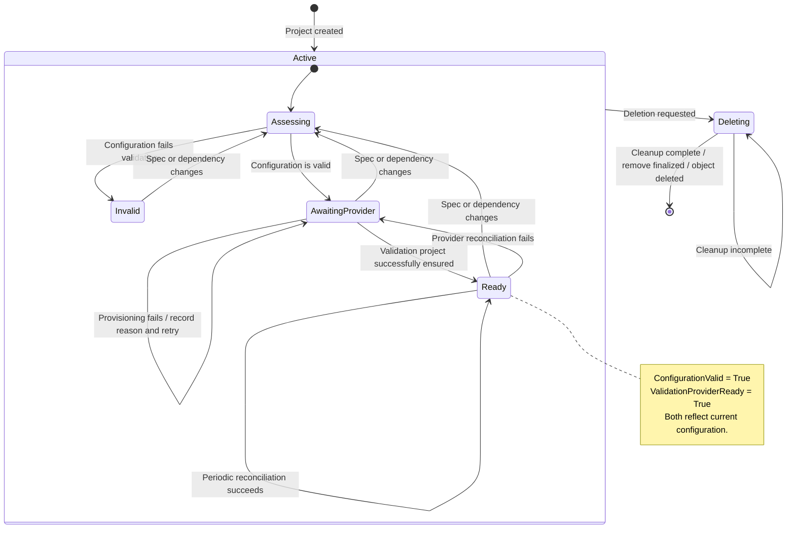

# SovereignProject Lifecycle

This diagram focuses on detailing the lifecycle of a SovereignProject resource. The SovereignProjectReconciler is the system which
holds the capabilities and policies that allow the control plane to reconcile this resource.

