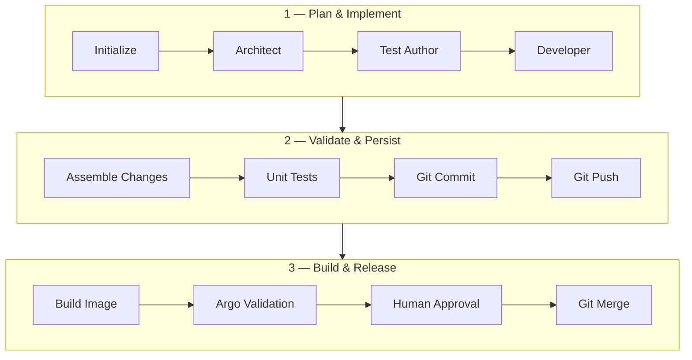

```mermaid
flowchart TB

    subgraph P1["1 — Plan & Implement"]
        direction LR
        A[Initialize] --> B[Architect] --> C[Test Author] --> D[Developer]
    end

    subgraph P2["2 — Validate & Persist"]
        direction LR
        E[Assemble Changes] --> F[Unit Tests] --> G[Git Commit] --> H[Git Push]
    end

    subgraph P3["3 — Build & Release"]
        direction LR
        I[Build Image] --> J[Argo Validation] --> K[Human Approval] --> L[Git Merge]
    end

    P1 --> P2 --> P3
```